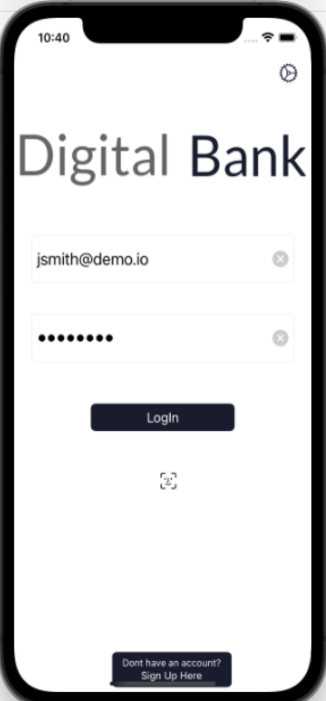
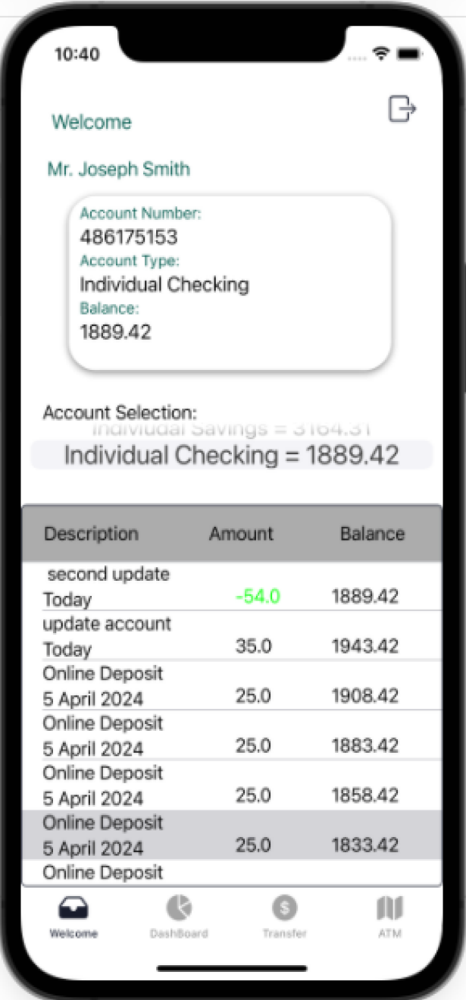
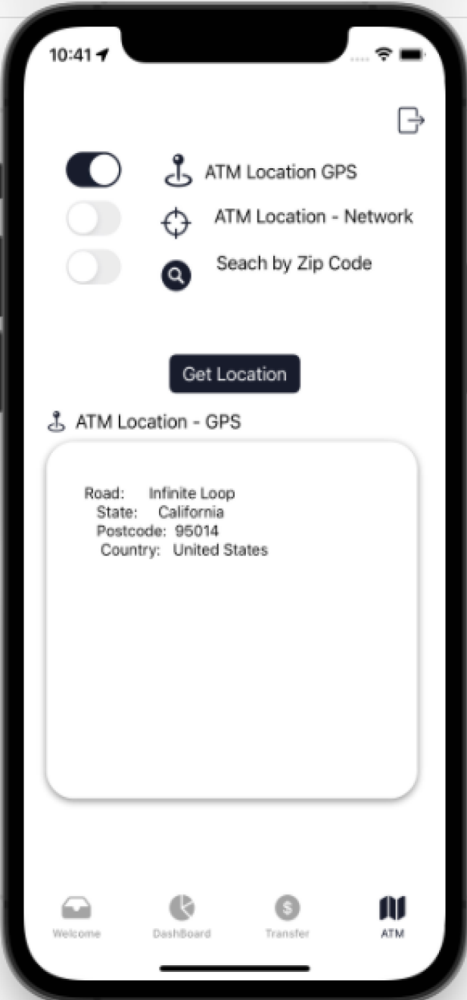

# Digital Bank Mobile App

Digital Bank Mobile App is a simple iOS app built using Swift and UIKit, it communicates with a demonstration server using REST API utilising the popular Swift networking library, Alamofire.
which provides a simple REST API for testing and prototyping. 

| | | |
|:-------------------------:|:-------------------------:|:-------------------------:|
|  Login Screen |   Account Summary Screen | ATM Search Screen  

## Features
 * Login / Logout
 * Account Summary
 * Dashboard view
 * Update Account using transfer screen
 * Queries using GPS and network
 * Network requests with Alamofire
 * JSON parsing
